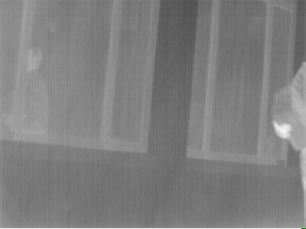
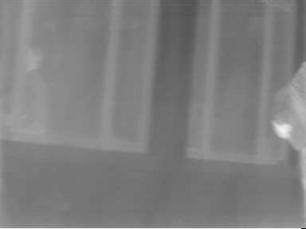

# Gaussian Scale Mixture Perceptual Pattern (GSMPP) denoiser 1.0
GSM-based IR non-uniformity denoising algorithm for vertical non-uniformity.

## Requirements (this is what the code was tested with)
- python 2.7
- numpy 1.10.1
- scipy 0.16.1
- scikit-learn 0.17
- scikit-image 0.11.3

## Running example

Call the script with the first argument being the non-uniformity degraded image, and
the second argument being the amount of non-uniformity to be removed. 
Note that this will only work with vertical non-uniformity in its current state.

Input image:



```
python2 GSM_DNU_method.py 2.bmp 0.038
```

Output image:




Total time to denoise this image:

```
$ time python2 GSM_DNU_method.py 2.bmp 0.038

real    2m10.388s
user    2m10.377s
sys     0m0.093s
```

Kindly report any suggestions or corrections to beyondmetis@gmail.com.

## License

Copyright (c) 2015 The University of Texas at Austin
All rights reserved.

Permission is hereby granted, without written agreement and without license or royalty fees, to use, copy, 
modify, and distribute this code (the source files) and its documentation for any purpose, provided that the 
copyright notice in its entirety appear in all copies of this code, and the original source of this code, 
Laboratory for Image and Video Engineering (LIVE, http://live.ece.utexas.edu) at the 
University of Texas at Austin (UT Austin, http://www.utexas.edu), is acknowledged in any publication 
that reports research using this code. The research is to be cited in the bibliography as:

1) T. Goodall, A. C. Bovik, Haris Vikalo, and Nicholas J. Paulter, Jr., "Non-uniformity Correction of IR Images using Natural Scene Statistics", Global Signal and Information Processing (GlobalSIP), December 2015 

IN NO EVENT SHALL THE UNIVERSITY OF TEXAS AT AUSTIN BE LIABLE TO ANY PARTY FOR DIRECT, INDIRECT, SPECIAL, INCIDENTAL, 
OR CONSEQUENTIAL DAMAGES ARISING OUT OF THE USE OF THIS DATABASE AND ITS DOCUMENTATION, EVEN IF THE UNIVERSITY OF TEXAS
AT AUSTIN HAS BEEN ADVISED OF THE POSSIBILITY OF SUCH DAMAGE.

THE UNIVERSITY OF TEXAS AT AUSTIN SPECIFICALLY DISCLAIMS ANY WARRANTIES, INCLUDING, BUT NOT LIMITED TO, THE IMPLIED 
WARRANTIES OF MERCHANTABILITY AND FITNESS FOR A PARTICULAR PURPOSE. THE DATABASE PROVIDED HEREUNDER IS ON AN "AS IS" BASIS,
AND THE UNIVERSITY OF TEXAS AT AUSTIN HAS NO OBLIGATION TO PROVIDE MAINTENANCE, SUPPORT, UPDATES, ENHANCEMENTS, OR MODIFICATIONS.
